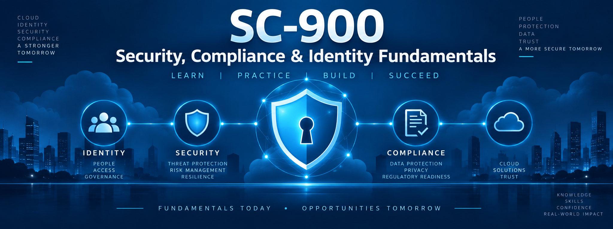

# 🛡️ SC-900 — Microsoft Security, Compliance, and Identity Fundamentals



Welcome to the **SC-900: Microsoft Security, Compliance, and Identity Fundamentals** training repository.

This course is designed to build a practical foundation in Microsoft security, identity, and compliance technologies while preparing for the **Microsoft SC-900 certification exam**.

---

## 🎯 Course Goals

By completing this course, you should be able to:

- Explain fundamental security, compliance, and identity concepts
- Understand the Zero Trust security model
- Explain authentication and authorization
- Understand Microsoft Entra ID
- Describe multifactor and passwordless authentication
- Understand Conditional Access
- Explain identity governance and privileged access
- Understand Microsoft's Azure security capabilities
- Describe Microsoft Defender for Cloud
- Understand Microsoft Defender XDR
- Explain Microsoft Sentinel and SIEM/SOAR
- Understand Microsoft Purview
- Explain sensitivity labels and Data Loss Prevention
- Understand retention, records management, audit, and eDiscovery
- Prepare for the Microsoft SC-900 certification exam

---

# 📊 SC-900 Exam Domains

The course follows the current Microsoft SC-900 skills measured.

| Exam Domain | Weight |
|---|---:|
| Security, Compliance & Identity Concepts | 10–15% |
| Microsoft Entra | 25–30% |
| Microsoft Security Solutions | 35–40% |
| Microsoft Compliance Solutions | 20–25% |

> Microsoft periodically updates certification exams. Always check the official Microsoft SC-900 study guide before scheduling your exam.

---

# 🗺️ Course Roadmap

## 🧠 Part 1 — Security, Compliance & Identity Concepts

### 📘 Lesson 01 — Security, Compliance & Identity Fundamentals
Learn the basic concepts behind security, compliance, identity, authentication, authorization, and identity providers.

### 📘 Lesson 02 — Shared Responsibility, Defense in Depth & Zero Trust
Understand the shared responsibility model, defense in depth, Zero Trust, encryption, hashing, and Governance, Risk, and Compliance (GRC).

---

## 👤 Part 2 — Microsoft Entra

### 📘 Lesson 03 — Microsoft Entra ID & Identity Types
Learn Microsoft Entra ID, cloud identities, hybrid identities, external identities, and identity concepts.

### 📘 Lesson 04 — Users, Groups & Identity Management
Explore users, groups, roles, identity management, and common Entra administrative concepts.

### 📘 Lesson 05 — Authentication & Multifactor Authentication
Understand authentication methods, MFA, password protection, and authentication security.

### 📘 Lesson 06 — Passwordless Authentication
Explore passwordless technologies and modern authentication methods.

### 📘 Lesson 07 — Conditional Access & RBAC
Learn how Conditional Access policies and role-based access control help protect organizational resources.

### 📘 Lesson 08 — Identity Governance & Protection
Explore Identity Governance, access reviews, Privileged Identity Management, and Entra ID Protection.

---

## 🛡️ Part 3 — Microsoft Security Solutions

### 📘 Lesson 09 — Azure Infrastructure Security
Learn Azure Firewall, Web Application Firewall, DDoS Protection, network segmentation, NSGs, Azure Bastion, and Key Vault.

### 📘 Lesson 10 — Microsoft Defender for Cloud
Understand cloud security posture management, recommendations, policies, standards, and workload protection.

### 📘 Lesson 11 — Microsoft Defender XDR
Explore Microsoft's extended detection and response platform and the Microsoft Defender portal.

### 📘 Lesson 12 — Microsoft Defender Security Services
Learn Defender for Endpoint, Office 365, Identity, Cloud Apps, Vulnerability Management, and Threat Intelligence.

### 📘 Lesson 13 — Microsoft Sentinel
Understand SIEM, SOAR, threat detection, investigation, and automated response.

---

## 📋 Part 4 — Microsoft Compliance Solutions

### 📘 Lesson 14 — Microsoft Purview & Compliance
Explore the Microsoft Purview portal, Compliance Manager, compliance score, privacy principles, and the Service Trust Portal.

### 📘 Lesson 15 — Information Protection, DLP & Data Lifecycle
Learn data classification, sensitivity labels, Data Loss Prevention, retention, records management, and data lifecycle concepts.

### 📘 Lesson 16 — Insider Risk, eDiscovery & Audit
Explore Insider Risk Management, Microsoft Purview eDiscovery, and auditing capabilities.

---

# 🧪 Hands-On Labs

Lessons with useful hands-on components will include guided labs.

Labs may include:

- Exploring Microsoft Entra ID
- Creating users and groups
- Reviewing authentication methods
- Exploring Conditional Access
- Reviewing identity roles
- Exploring Defender portals
- Reviewing Defender for Cloud recommendations
- Exploring Microsoft Sentinel
- Exploring Microsoft Purview
- Working with sensitivity labels
- Exploring compliance features

> Some Microsoft security and compliance features require specific licenses, subscriptions, roles, or tenant configurations. Labs will identify these requirements when applicable.

---

# 🏗️ Projects

Projects combine concepts from multiple lessons.

Planned projects:

### Project 1 — Secure an Organization's Identity Environment

Apply Entra, MFA, Conditional Access, roles, and Zero Trust concepts to a fictional organization.

### Project 2 — Build a Microsoft Security Strategy

Determine how Defender, Azure security services, and Sentinel could protect an organization's environment.

### Project 3 — Build a Compliance & Data Protection Strategy

Use Purview concepts to design classification, sensitivity, DLP, retention, and compliance controls.

### Project 4 — SC-900 Security Architecture Challenge

Bring identity, security, and compliance concepts together into a complete Microsoft security strategy.

---

# 📝 Practice Exams

The repository will include:

### Practice Exam 1

Covers:

**Lessons 01–08**

Focus:

- Security concepts
- Zero Trust
- Identity
- Microsoft Entra
- Authentication
- Conditional Access
- Identity governance

### Practice Exam 2

Covers:

**Lessons 09–16**

Focus:

- Azure security
- Microsoft Defender
- Microsoft Sentinel
- Microsoft Purview
- Compliance
- Information protection

### Final Comprehensive Exam

Covers:

**Lessons 01–16**

The final exam will mix topics and include more scenario-based questions.

---

# 📚 Repository Structure

```text
SC-900-Security-Compliance-and-Identity-Fundamentals/
│
├── images/
│
├── lessons/
│
├── labs/
│
├── projects/
│
├── practice-exams/
│
├── references/
│
├── resources/
│
└── README.md
